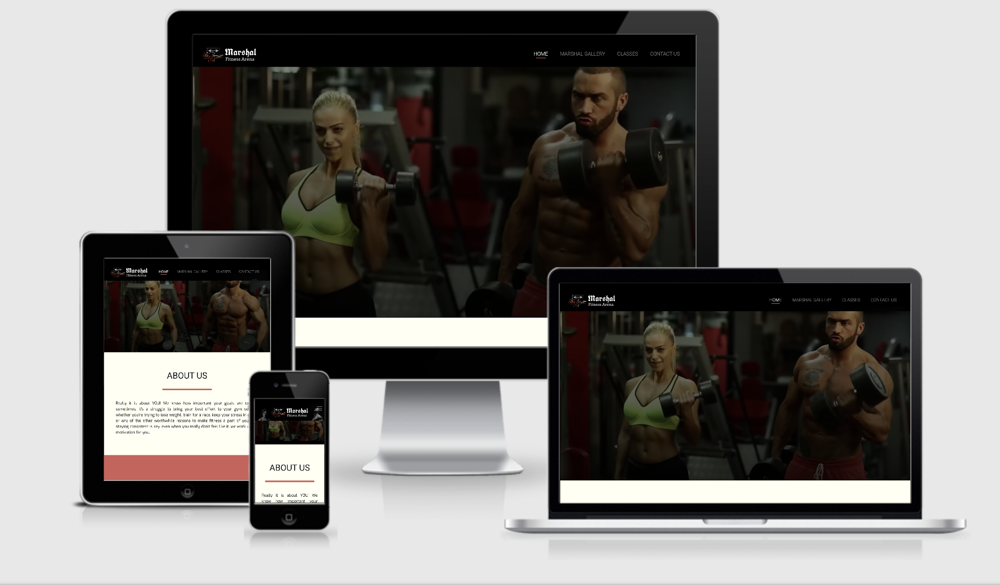

# MARSHAL FITNESS ARENA WEBSITE
## DESCRIPTION
## DEPLOYMENT AND DEMO
Website has been deployed to <a href="https://seagather.github.io/Marshal-Fitness-Arena/">Github Pages.</a>
## WIREFRAME
The skeletal framework of this website was designed using <a href="https://balsamiq.com">Balsamiq</a> as a visual guide to represent the page schematic and screen blueprint.

Links to final version of the wireframe can be found below:
<ul>
<li><a href="https://seagather.github.io/Marshal-Fitness-Arena/wireframes/marshal-fitness-wireframe.pdf">Wireframe Final Version</a></li>
</ul>

## UX
user experience
<a href="https://seagather.github.io/Marshal-Fitness-Arena/assets/images/responsive.png">

I used <a href="https://tinypng.com">tinypng.com</a> which utilised smart lossy compression techniques to reduce the file size of PNG and JPG files. This shrunk the image size to 41%.
the site uses less bandwith and load faster
<a href="https://seagather.github.io/Marshal-Fitness-Arena/assets/images/image-compressor.png">

I decided to use 
<ul>
<li>Aba</li>
<li>Otu</li>
<li>Onitsha</li>
<ul>

This is the Code Institute student template for Gitpod. We have preinstalled all of the tools you need to get started. You can safely delete this README.md file, or change it for your own project.

## Gitpod Reminders

To run a frontend (HTML, CSS, Javascript only) application in Gitpod, in the terminal, type:

`python3 -m http.server`

A blue button should appear to click: *Make Public*,

Another blue button should appear to click: *Open Browser*.

To run a backend Python file, type `python3 app.py`, if your Python file is named `app.py` of course.

A blue button should appear to click: *Make Public*,

Another blue button should appear to click: *Open Browser*.

In Gitpod you have superuser security privileges by default. Therefore you do not need to use the `sudo` (superuser do) command in the bash terminal in any of the backend lessons.

## Updates Since The Instructional Video

We continually tweak and adjust this template to help give you the best experience. Here are the updates since the original video was made:

**April 16 2020:** The template now automatically installs MySQL instead of relying on the Gitpod MySQL image. The message about a Python linter not being installed has been dealt with, and the set-up files are now hidden in the Gitpod file explorer.

**April 13 2020:** Added the _Prettier_ code beautifier extension instead of the code formatter built-in to Gitpod.

**February 2020:** The initialisation files now _do not_ auto-delete. They will remain in your project. You can safely ignore them. They just make sure that your workspace is configured correctly each time you open it. It will also prevent the Gitpod configuration popup from appearing.

**December 2019:** Added Eventyret's Bootstrap 4 extension. Type `!bscdn` in a HTML file to add the Bootstrap boilerplate. Check out the <a href="https://github.com/Eventyret/vscode-bcdn" target="_blank">README.md file at the official repo</a> for more options.

--------

Happy coding!
