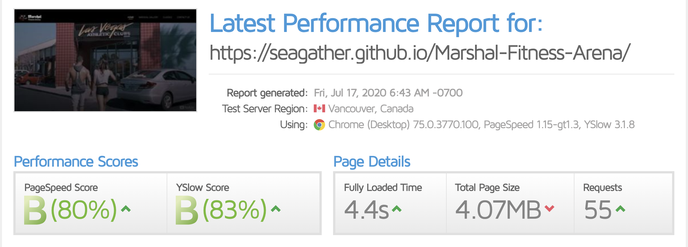

# MARSHAL FITNESS ARENA WEBSITE
## DESCRIPTION
This is an imaginary gym website created in partial fufillment of the requirements for Diploma in Software Development.
The idea is to captivate users at a glance as well as advancing the site owner's services.

At Marshal Fitness Arena, We know how important your goals are to you, sometimes, it's a struggle to bring your best effort to your gym session. whether you're trying to lose weight, train for a race, keep your stress in check, or any of the other worthwhile
reasons to make fitness a part of your life, staying consistent is key, even when you really don't feel like it, we work up the motivation for you at an affordable rate.
## DEPLOYMENT AND DEMO
Website has been deployed to <a href="https://seagather.github.io/Marshal-Fitness-Arena/">Github Pages.</a>
## WIREFRAME
The skeletal framework of this website was designed using <a href="https://balsamiq.com">Balsamiq</a> as a visual guide to represent the page schematic and screen blueprint.

Links to final version of the wireframe can be found below:
<ul>
<li><a href="https://seagather.github.io/Marshal-Fitness-Arena/wireframes/marshal-fitness-wireframe.pdf">Wireframe Final Version</a></li>
</ul>

## UX
The focus here is ensuring that users find value in what the gym provides, usable, useful, desirable, findable, credible and accessible
<ul>
<li>Home Page: subtly displays an embed-responsive-16by9 video-style of unisex with dark overlay on top and the <strong>"About Us"</strong> information</li>
<li>Gallery Page: maximizes Bootstrap4 Carousel to showcase the training ground cum gym facilities and the company's ethos
<li>Classes Page: a Grid system with inner card elements presents different classes and benefits</li>
<li>Contact Page: Contact page contains a contact form for users with a google Map location</li>
</ul>

## User experience

I used <a href="https://tinypng.com">tinypng.com</a> which utilised smart lossy compression techniques to reduce the file size of PNG and JPG files. This shrunk the image size to 41%.
the site uses less bandwith and load faster.

## Visual identity
<ul>
<li><a href="https://logomaker.com">LogoMaker</a> was used for the logo design</li>
</ul>

## Users Stories

Gym Users:
<ul>
<li>As a user, I want to register and enroll in a beffiting class session</li>
<li>As a user, I want to access the gym training grounds and facilities</li>
<li>As a user, I want to know the location, opening hours vis-à-vis classes in sync with my timeline and goals</li>
<li>As a user, I want the gym instructor to track my progress</li>
<li>As a user, I want to exercise rightly in an enabling environment</li>
</ul>

Gym Owners:
<ul>
<li>As a owner, I want my gym center to be desirable and accessible to users</li>
<li>As a owner, I want to know what my contemporaries are doing and ways to improve</li>
<li>As a owner, I want end-user feedback in shaping services to fit their needs more accurately</li>
<li>As a owner, I want users to get notifications via newsletter when there are new offers</li>
</ul>

## TESTING
Website was tested on <a href="https://gtmetrix.com">GTmetrix</a> and <a href="https://tools.pingdom.com">Pingdom</a> platforms

## SCALABILITY

--------

